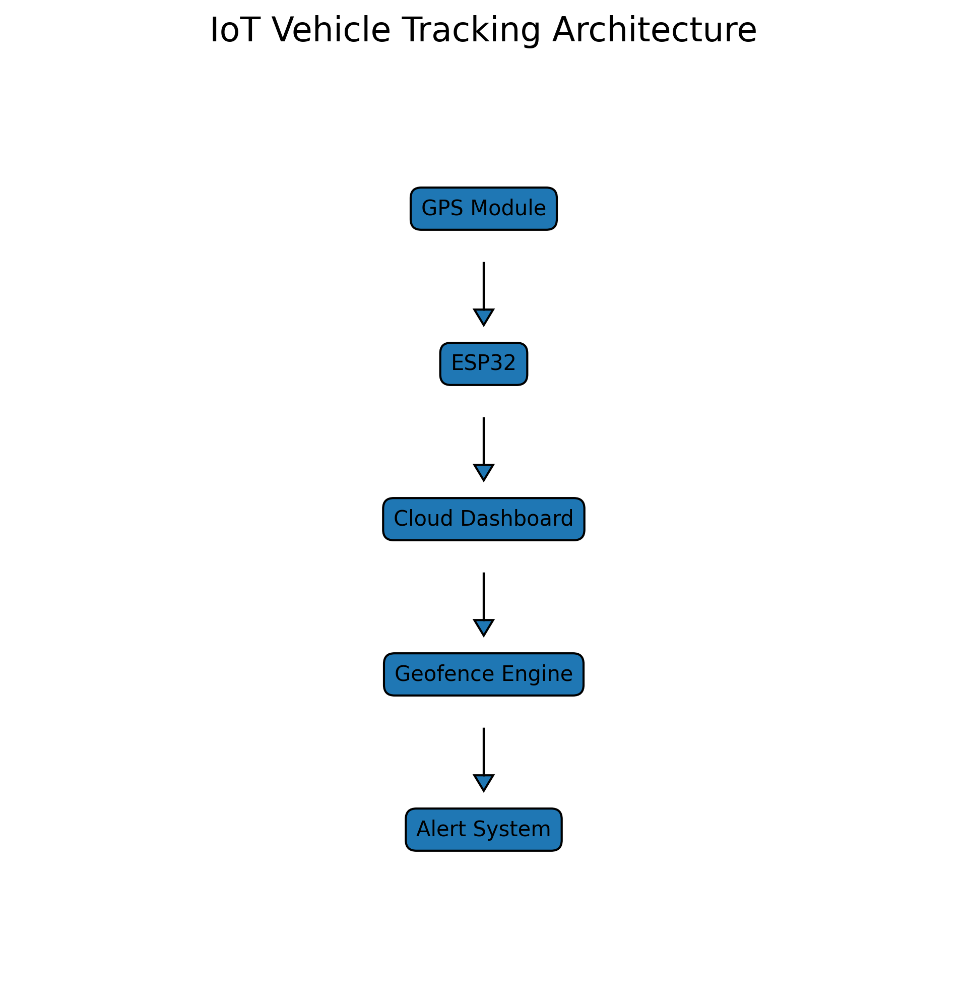
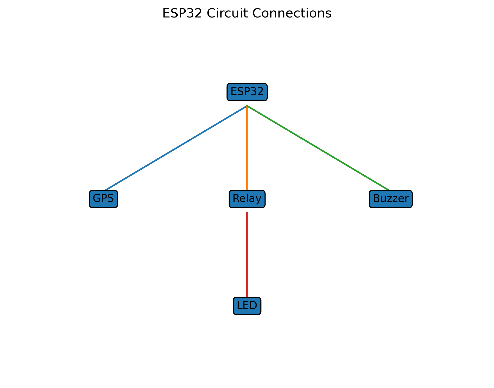
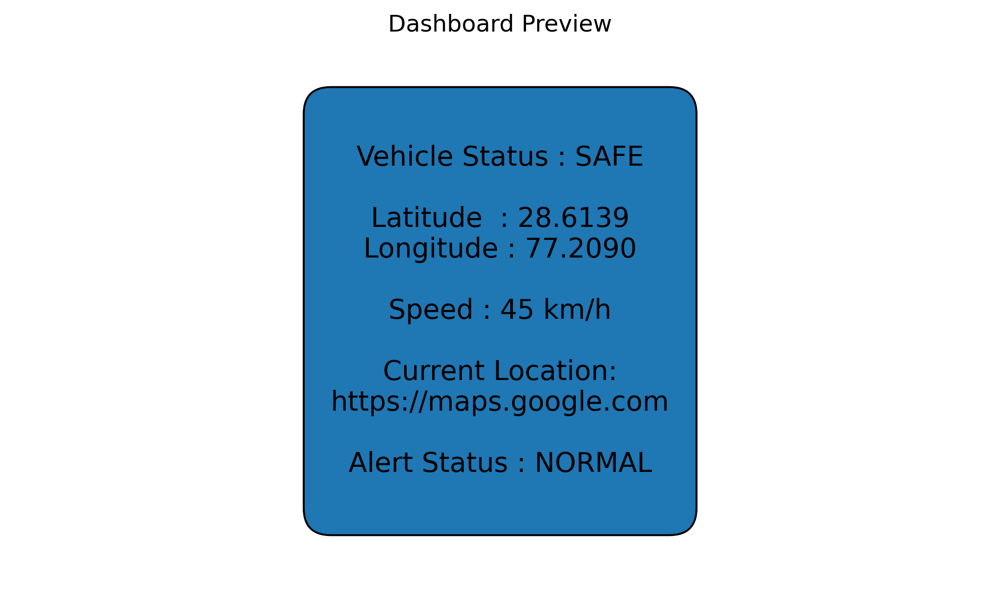
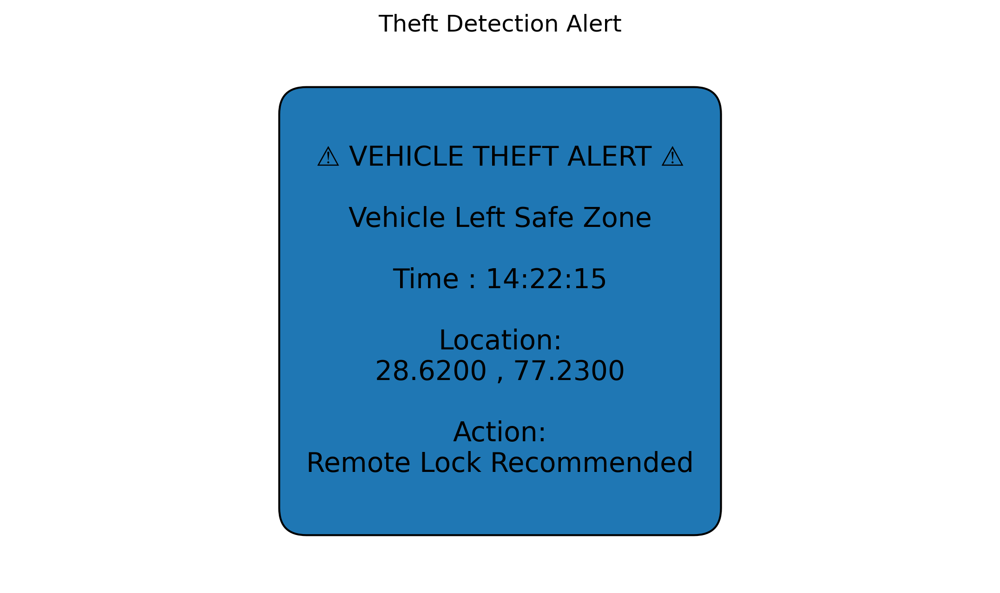

# IoT Vehicle Tracking & Theft Prevention System

## Overview

The IoT Vehicle Tracking & Theft Prevention System is a smart vehicle monitoring solution that uses GPS tracking, geofencing, and IoT concepts to monitor vehicle movement and detect unauthorized activity. The system simulates real-time vehicle location tracking, generates Google Maps links, and raises theft alerts when the vehicle leaves a predefined safe zone.

This project demonstrates the practical application of IoT, GPS technology, geofencing, and vehicle security systems used in modern fleet management and intelligent transportation solutions.

---

## Project Objective

To develop an IoT-based vehicle tracking and theft prevention system capable of:

* Tracking vehicle location in real time
* Monitoring vehicle movement
* Detecting unauthorized movement using geofencing
* Generating theft alerts
* Providing location information through Google Maps links
* Demonstrating real-world vehicle security concepts

---

## Features

* Real-time GPS coordinate simulation
* Geofence-based theft detection
* Vehicle status monitoring
* Google Maps location generation
* Automated alert generation
* Architecture visualization
* Circuit design visualization
* Dashboard preview generation
* Theft alert visualization

---

## Technology Stack

### Hardware

* ESP32 Microcontroller
* NEO-6M GPS Module
* Relay Module
* Buzzer
* LED Indicators

### Software

* Python
* Pandas
* Geopy
* Matplotlib
* Arduino IDE

---

## Project Structure

```text
## Project Structure

IoT-Vehicle-Tracking-Theft-Prevention-System/

├── arduino_code/
│   └── vehicle_tracker.ino
│
├── python_simulation/
│   ├── gps_simulator.py
│   ├── geofence.py
│   └── theft_detection.py
│
├── data/
│   └── sample_coordinates.csv
│
├── images/
│   ├── architecture_diagram.png
│   ├── circuit_diagram.png
│   ├── dashboard_preview.png
│   └── geofence_alert.png
│
├── gitignore
├── README.md
├── requirements.txt
└── main.py
```

---
## System Workflow

```text
GPS Module
    ↓
ESP32
    ↓
Cloud Dashboard
    ↓
Geofence Engine
    ↓
Alert System
    ↓
User Dashboard
```

---

## Generated Outputs

### Architecture Diagram



### Circuit Diagram



### Dashboard Preview



### Theft Alert



---

## Installation

### Install Dependencies

```bash
pip install -r requirements.txt
```

### Run Project

```bash
python main.py
```

---

## Sample Output

```text
IoT Vehicle Tracking & Theft Prevention System

Latitude : 28.6139
Longitude : 77.2090
Status : SAFE

Google Maps:
https://www.google.com/maps?q=28.6139,77.2090
```

---

## Applications

* Fleet Management
* Vehicle Security
* Logistics Tracking
* School Bus Monitoring
* Delivery Vehicle Tracking
* Smart Transportation Systems

---

## Future Enhancements

* Live GPS Integration
* Mobile Application Support
* MQTT Communication
* Cloud Dashboard Integration
* SMS Notifications
* Email Alerts
* AI-Based Route Analysis
* Remote Engine Lock/Unlock

---

## Learning Outcomes

Through this project, students gain practical knowledge of:

* Internet of Things (IoT)
* GPS Tracking Systems
* Vehicle Telematics
* Geofencing
* Python Programming
* Embedded Systems
* Data Visualization
* Security Monitoring Systems

---

## Author

~Ananya Jain
---


This project is intended for educational and learning purposes.
